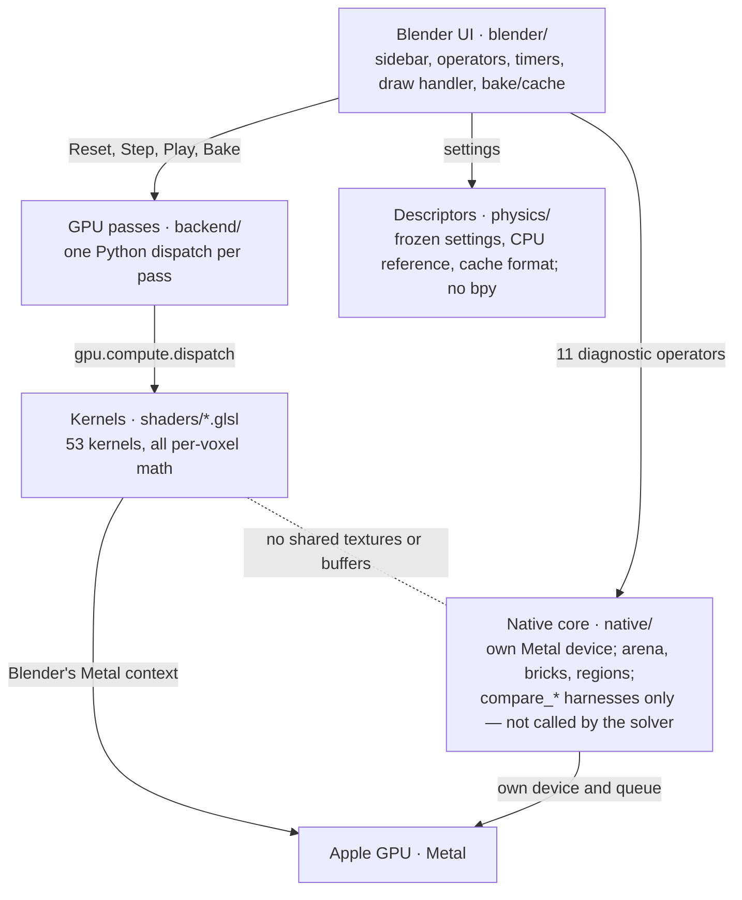
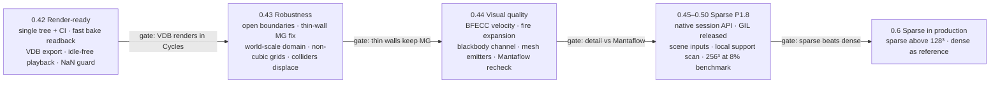

# FluxFX 0.41 Engineering Audit

**Audited:** commit `249165b` on `claude-development` (2026-10-05), including the `FluxFX_Source/` tree.
**Scope:** full read of the Python add-on (~5,900 lines), all 53 GLSL kernels, and the ~2,000 lines of native C++ / Objective-C++ / Metal.
**Changes made during the audit:** none. Nothing blocked analysis or testing.

Findings are ranked **CRITICAL**, **HIGH**, **MEDIUM** or **LOW**.

File paths below refer to the repository root. `FluxFX_Source/fluxfx/` holds a byte-identical copy of every Python, GLSL and doc file (only the root has the `.so`), so the same line numbers apply there. Native sources live only in `FluxFX_Source/native/`.

## Summary

The dense GPU smoke solver is numerically sound and unusually well measured. It cannot yet produce a final render, it stops at 128³, and the native sparse engine is still a validation harness that never touches a scene. The recommended next milestone is a **render-ready dense pipeline (0.42)**, not more sparse work.

---

## A. Current architecture

FluxFX is a Python add-on that drives Blender's own GPU context. The compiled native core sits beside the solver, not under it.

- **Versioning by inheritance.** `DenseAdvection → DenseMACAdvection → DenseThermalAdvection → DenseProjectedSmoke` (`backend/projected.py:13`). Each historical milestone class is still the base of the production class.
- **Colliders use a device decorator.** `SolidDevice` / `MovingSolidDevice` (`backend/collision.py`, `backend/moving_collision.py`) add `#define FLUXFX_COLLISIONS` and a mask sampler to any kernel whose filename is in `VARIANTS`.
- **One session per scene.** A global `Runtime` (`blender/runtime.py`) owns all GPU state. Everything runs on the main thread through `bpy.app.timers`.
- **Two package trees.** The repository root is the installable extension with the `.so` committed. `FluxFX_Source/` is the development tree (scripts, tests, native sources); its `.gitignore` excludes `*.so`.

## B. Simulation pipeline

Every simulation step runs on Blender's main thread as a chain of individual Python dispatch calls, and ends with a synchronous GPU readback.

1. **Play** calls `runtime.start()`, which registers the `tick()` timer.
2. Each tick:
    1. `settings_from_scene` builds a validated `GridSpec` and `PressureSettings`.
    2. `ensure_current` rebuilds the session on reset-only changes, or applies live updates.
    3. `PlaybackClock` computes how much wall-clock time is owed.
3. Each substep inside the tick (`backend/projected.py:149`):
    1. Adaptive dt, if enabled: five GPU max-reduction chains, then five synchronous 1-texel reads.
    2. Moving colliders, if enabled: re-mask, compute wall velocities, remap fields.
    3. Velocity self-advection (RK2 midpoint semi-Lagrangian, optional MacCormack) with emitter jets blended in.
    4. Buoyancy on the vertical faces, using the previous step's density and temperature.
    5. Optional turbulence forcing, then optional vorticity confinement.
    6. Pressure projection: walls, divergence, Jacobi or multigrid solve, gradient subtraction.
    7. Scalar advection of density, temperature and fuel, with swept-sphere emission.
    8. Combustion burn and apply.
    9. `StepCompletion.wait`: a fence kernel plus a 1-pixel synchronous readback.
4. The viewport draw handler raymarches the selected field in `POST_PIXEL`, with no depth test.

**Bake** runs the same solver from a timer and reads every channel back to the CPU each frame (`backend/cache.py:7`). `CacheWriter` then writes it atomically with CRC32 and optional zlib.

**Cache playback** is driven by `frame_change_post`: a timer pulls the frame from an LRU, validates it with NumPy, uploads a new texture and reuses the same raymarcher.

## C. Implemented systems

The dense production path is complete and internally consistent. The stencil, residual, restriction and prolongation scaling, and the source-table packing were each cross-checked against one another and agree.

- **Dense MAC smoke solver, up to 128³.** RK2 semi-Lagrangian advection with bounded MacCormack for scalars. Pressure uses Neumann walls and an impulse formulation that rescales the warm start when dt changes.
- **Pressure solvers.** Weighted Jacobi, and geometric multigrid V-cycles with a pseudo-inverse direct solve on the 4³ coarse grid.
- **Adaptive CFL** including an acceleration term, with NaN and Inf detection inside the GPU reductions.
- **Live parameter edits** without reallocating fields (`physics/interaction.py`, `LIVE_FIELDS`).
- **Emitters.** Up to 8 spherical sources, jets, motion inheritance and order-independent jet blending. Moving sources use an exact time-average of the swept sphere profile (`shaders/emission_weight.glsl`).
- **Static colliders.** Sphere and box primitives, plus closed-manifold mesh colliders built from a CPU BVH signed distance. Obstacle-aware aggregation multigrid with a Galerkin-consistent `R = Pᵀ/8`.
- **Moving rigid sphere and box colliders**, with wall velocities from slerped poses.
- **Effects.** Vorticity confinement, divergence-free Fourier turbulence forcing, and a basic fuel, ignition and burn model.
- **Bake and cache.** Atomic writes, CRC32, SHA-256 staleness fingerprints, zlib, an LRU frame memory, prefetch and animated-input baking.
- **Native infrastructure.** Metal probe, arena suballocator, brick pool with hashed topology, and the region tracker. All are real and tested.

## D. Partially implemented systems

The native sparse engine is the largest partial system: it is correct against dense, but it is a test harness that never touches a scene.

| System | What exists | What is missing |
| --- | --- | --- |
| Native sparse engine (P1.4–P1.8) | Transport, MAC velocity, Jacobi, multigrid, coupled, hybrid, adaptive and capacity paths, all matching dense | Lives entirely inside `compare_*` functions with synthetic seeds and hard-coded emission (`FluxFX_Source/native/projection.mm:115`). Recompiles Metal and reads everything back on every call. No persistent session, no scene inputs, GIL held, no speed win over dense |
| Active regions | Source-swept brick activation with linger and halo | Visualisation only; ignores the flow field |
| Mesh colliders | Signed distance computed on Reset | Thresholded to a binary mask, so no fractional boundaries. Static only, one shell, at most 50k triangles |
| Moving colliders | Rigid sphere and box | Covered smoke is deleted, not displaced (`shaders/moving_remap_scalar.glsl:5`). Jacobi only; no mesh support |
| Combustion | First-order burn | Hard ignition threshold. No expansion, flame-temperature cap, oxygen or blackbody. The flame display is the burn rate |
| Checkpoints | Save and load of full solver state | Scripting only; excludes colliders |

## E. Missing systems

Two gaps block production use outright: nothing reaches a final render, and nothing runs above 128³.

| Severity | Missing system | Consequence |
| --- | --- | --- |
| CRITICAL | Render and export path: no OpenVDB, no Blender Volume datablock, no EEVEE or Cycles integration | FluxFX cannot produce a deliverable frame. The viewport overlay has no depth occlusion |
| CRITICAL | Resolution above 128³ | `GridSpec` caps at 128 (`physics/config.py:12`) and the UI only offers cubes (`blender/runtime.py:62`). The sparse path that would lift this is not connected |
| HIGH | Physical domain scale and aspect ratio | Physics always runs in a 1 m unit cube; scaling the domain only stretches the visuals. A 10 m explosion cannot be simulated at correct scale |
| HIGH | Open or outflow boundaries | Closed box only, so smoke piles up against the ceiling |
| MEDIUM | Mesh, particle and texture emitters | Only spheres can emit |
| MEDIUM | Noise and upres (wavelet-style turbulence on a finer grid) | Fine detail is limited to the simulation grid |
| MEDIUM | Deforming colliders, adaptive domain, velocity in the cache | Animated characters cannot collide; bakes cannot be resumed |
| LOW | Windows, Linux and Vulkan support | macOS arm64 only |

## F. Bugs and correctness risks

Two defects were reproduced during the audit: the obstacle multigrid collapses behind a single thin wall, and the native brick hash table degrades about 4,500× under churn.

| Severity | Finding | Evidence |
| --- | --- | --- |
| HIGH | Obstacle multigrid stops coarsening for the whole grid when any one 2×2×2 aggregate is split by a wall. The coarsest level then exceeds the 256-cell direct-solve limit and falls back to 80 Jacobi sweeps per cycle | Measured: a 1-voxel plate at z=32 keeps 5 levels; at z=33 only 2 remain, coarsest 32³ = 32,768 cells. Thickness does not help; alignment to powers of two decides it. `physics/solid_hierarchy.py:46`, `backend/solid_multigrid.py:53` |
| HIGH | Native brick hash table accumulates tombstones and never rehashes. With zero empty slots, every lookup miss scans the whole table | Measured: 0.026 µs → 116 µs per query after 200k operations. Results stay correct, so `bricks_test` passes. `FluxFX_Source/native/bricks.hpp:61` |
| MEDIUM | NaN blow-ups go undetected in fixed-dt mode: the completion fence samples only voxel (0,0,0). Adaptive mode catches them | `shaders/benchmark_fence.glsl:5`, `backend/completion.py:14` |
| MEDIUM | Moving colliders make the pressure system incompatible: the voxelised solid volume changes inside a closed box and nothing removes the mean | `backend/collision.py:80` |
| MEDIUM | "Detailed" motion transport is hard-blended 50/50 with first-order transport, so it is only half-corrected. Likely contributes to the detail gap against Mantaflow | `shaders/correct_velocity_fused.glsl:26` |
| MEDIUM | Curl and confinement ignore obstacles, adding spurious forces at obstacle surfaces | `shaders/curl.glsl` and `shaders/confinement.glsl` are absent from `VARIANTS` (`backend/collision.py:6`) |
| MEDIUM | `register()` silently does nothing if a stale `Scene.fluxfx` exists, leaving the add-on enabled with no operators | `blender/addon.py:826` |
| LOW | The 384-step solid trace cap silently stops tracing beyond 128³; it becomes live once the grid cap is lifted | `shaders/solid_boundary.glsl:27` |

## G. Performance bottlenecks

The GPU work is fast; the Python and synchronisation around it dominate. At 128³, baking spends roughly 8× longer copying data in Python than simulating.

| Severity | Bottleneck | Evidence |
| --- | --- | --- |
| HIGH | Bake data copying at 128³: `device.read` builds `list(buffer)`, then `CacheWriter` builds `array('f', list)` | About 140 ms per channel plus 740 ms for five channels: roughly 1.4 s per frame of Python against about 170 ms of simulation. `backend/device.py:81`, `physics/cache.py:96` |
| HIGH | Cache playback fingerprints the whole scene on every timer tick, even when the frame has not changed. Animated caches also serialise every keyframe to JSON each tick | `cache_matches()` runs at `blender/cache.py:291`, before the early return at `:301`; the timer re-arms at scene FPS indefinitely |
| HIGH | Everything is synchronous: a fence readback per substep, five separate reduction readbacks, and native calls that hold the GIL during `waitUntilCompleted` | The CPU and GPU never overlap. `backend/timestep.py:30`, `blender/runtime.py:283`; no `Py_BEGIN_ALLOW_THREADS` anywhere in `FluxFX_Source/native/` |
| MEDIUM | Reset with obstacles at 128³ blocks the UI for several seconds | Hierarchy build 5.0 s (pure Python, measured), per-element upload validation 0.33 s, mesh signed distance about 3 s (extrapolated from 0.37 s at 64³). Every Reset also reruns the GPU probe (`blender/runtime.py:128`) and compiles 3 unused legacy shaders |
| MEDIUM | Bake re-fingerprints the scene every tick before its "already prepared" check, then sleeps 10 ms after each 20 ms work slice | About a third of bake time is idle. `blender/cache.py:135`, `:237` |
| MEDIUM | Mesh colliders re-run `to_mesh()` and rebuild the vertex tuple every playback tick | Cost scales with triangle count, up to 50k. `blender/collider.py:51` via `ensure_current` |
| LOW | A diagnostic-only divergence pass runs every step; cached frames are validated twice; a new texture is allocated per cached frame | Small, steady overhead |

Timings were measured on the audit's Linux sandbox CPU, not the M5 Pro; treat them as relative.

## H. Blender integration risks

The add-on is validated on exactly one Blender alpha build, and the APIs it depends on are still moving.

- **Locked to one build.** Requires Blender 5.3 Alpha; validated on build `b2e052b7172a` only. The GPU compute and image Python API and the slotted-actions API are both evolving.
- **Native binary.** Built against Xcode's Python 3.9 headers with the stable ABI, then loaded into Python 3.13. It is unsigned, and a rebuilt binary needs a Blender restart.
- **Undo destroys the live session.** Any undo or redo triggers shutdown through `undo_pre` and `redo_pre`.
- **Timers depend on `bpy.context`** inside callbacks, and fetch the evaluated depsgraph several times per tick.
- **One session per scene**, and no depth compositing in the viewport.
- **Developer diagnostics ship in the user UI**: 11 native comparison operators sit in the main panel.

## I. GPU and native implementation assessment

The GLSL is sound and defensive; the native code is clean but is a harness, not an engine.

**GLSL kernels**

- Strengths: `texelFetch` with manual trilinear interpolation (no reliance on sampler state), explicit bounds checks, correct wall handling.
- Each pass is a separate Python dispatch with uniform marshalling. A 2-cycle V-cycle at 128³ is about 90 Python calls.
- No use of shared memory and no kernel fusion.

**Native C++ / Objective-C++ / Metal**

- Strengths: clean RAII, strict input validation, honest memory accounting, `fastMathEnabled=NO` for comparison runs.
- `compare_projection` takes 13 positional parameters and rebuilds paired sparse and dense engines on every call.
- One compute encoder per dispatch, where a single serial encoder would do.
- Never integrated with Blender's textures. By the project's own `docs/DENSITY_CAPACITY.md`, it is still slower than dense at 128³ because of the full-domain support scan.

## J. Technical debt

The most urgent debt is structural: two identical copies of the add-on that will start drifting with the next commit.

1. **Two package trees.** The repository root is the installable tree with the `.so` committed. `FluxFX_Source/fluxfx` is a byte-identical copy whose `.gitignore` excludes `*.so`, and `build_native.py` writes the binary there.
2. **Versioning by inheritance.** The production class chain keeps legacy kernels compiled and calls `reset()` four times during construction.
3. **Two emitter data models.** The primary source and additional emitters have separate property groups and separate shader paths. The single-source path swaps settings in and out with `replace()` on every substep (`blender/runtime.py:278`).
4. **Copy-pasted operators.** The native comparison operators in `blender/addon.py` differ only in function and report names.
5. **Dense, semicolon-chained code** in `blender/addon.py` and `native/*.mm` that slows review.
6. **Version string in four places**: manifest, `bl_info`, `scripts/package.py`, panel label. The native module docstring still says "P1.2".
7. **Docs read as a changelog.** The README is a release log, there are 43 milestone docs, and the extension zip ships 5.6 MB of validation evidence.

## K. Test coverage

Everything that can run without Blender passes, but nothing exercises the GPU path automatically and there is no CI.

| Check run during the audit | Result |
| --- | --- |
| `python3 -m unittest discover -s tests` (in `FluxFX_Source/`) | 146/146 pass in 0.7 s, with and without NumPy |
| `compileall` over both package trees | Clean |
| pyflakes | No undefined names; 26 unused imports, 25 of them in scripts and tests |
| Native CPU tests (`arena_test`, `bricks_test`, `regions_test`) built with `g++ -std=c++17 -O2 -Wall -Wextra -Werror` | All pass |
| GPU and Blender validation scripts (75+) | Not run: they need graphical Blender 5.3 on Apple Silicon |

**Covered:** physics descriptors, the CPU reference solvers, the cache format, the frame LRU, the playback clock, timestep selection, collider motion, mesh validation and hierarchy topology.

**Not covered:**

- No CI, and the native C++ tests are not wired into any script.
- No automated coverage of GLSL, backend dispatch or the `blender/` package.
- No performance regression tests; one would have caught the hash-table tombstone issue.
- No hierarchy-depth test with thin walls.
- No golden-image tests.

GPU validation is ~75 manual graphical-Blender scripts with archived JSON. That is good evidence, but it cannot be rerun automatically.

## L. Top 10 priorities

The first four make the existing solver deliverable; the rest make it robust and higher quality.

1. **Single source of truth plus CI.** Make `FluxFX_Source` canonical, treat the root as build output, and ship the `.so` as a release asset rather than a git file. Add CI running the Python suite and the three native CPU tests; both already work on Linux.
2. **Render and export path.** Write OpenVDB (density, temperature, flame) from the bake and load it as a Blender Volume for Cycles and EEVEE. First confirm whether the 5.3 build bundles a Python `openvdb` module.
3. **Fix bake data copying.** Read GPU buffers through NumPy views, pass arrays straight through, and drop `list()`. Priority 2 depends on this.
4. **Stop per-tick fingerprinting.** Recompute on frame change or depsgraph updates only, in both playback and bake.
5. **Obstacle multigrid robustness.** Handle split aggregates locally instead of aborting globally, and vectorise or nativise `build_hierarchy`.
6. **Open and outflow boundaries:** p = 0 on open faces plus scalar outflow.
7. **Brick hash table.** Use backward-shift deletion or rehash when tombstones accumulate, and add a performance assertion to `bricks_test`.
8. **NaN guard independent of adaptive dt.**
9. **Fewer sync points.** One reduction readback instead of five, fences only at budget boundaries, and release the GIL in native calls.
10. **Quality pass against Mantaflow** with the existing comparison harness: full or BFECC velocity correction instead of the 50/50 blend, obstacle-aware confinement, and combustion with expansion and a flame-temperature channel.

## M. Recommended next milestone: 0.42 "Render-ready dense pipeline"

Ship priorities 1–4 plus the NaN guard (8) as 0.42. Nothing FluxFX simulates can reach a final frame today, and the sparse path will not change that: it has no speed advantage yet and is not connected to the solver.

**Exit criteria**

- [ ] A 128³, 120-frame fire bake exports to a VDB sequence and renders in Cycles with Principled Volume and blackbody.
- [ ] Data copying takes under 15% of bake frame time.
- [ ] An idle loaded cache costs effectively nothing on the main thread.
- [ ] CI is green on every push.
- [ ] Fixed-dt mode detects a NaN anywhere in the grid.

## N. Roadmap from 0.41

Order the work as output, then robustness, then quality, and only then the sparse engine; each release passes a gate before the next starts.

The 0.45–0.50 gate is the P1 roadmap's own efficiency gate: sparse must beat dense at a 256³-equivalent domain with about 8% occupancy. Later work: noise and upres, deforming colliders, Windows and Vulkan.
