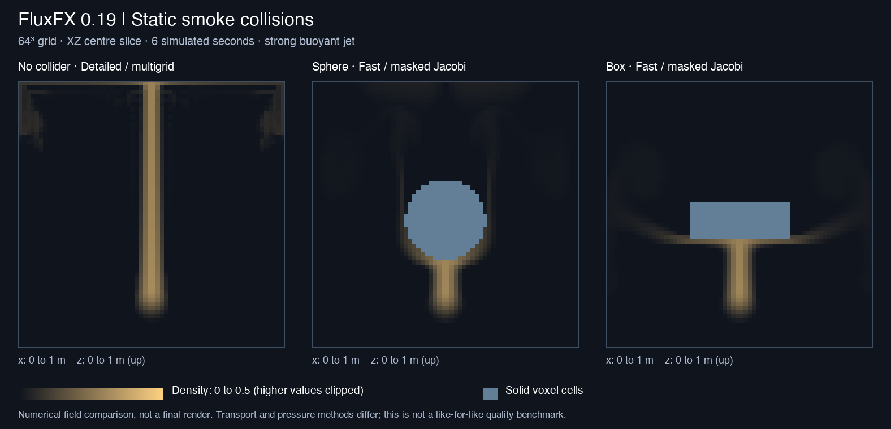

# FluxFX 0.19 — static sphere and box collisions

This page records the 0.19 baseline. For current solver behavior and performance,
see [0.20 collider speed and detail](COLLIDER_DETAIL.md).

Up to eight Blender Empty objects now define solid obstacles inside the smoke
domain. Smoke and heat are excluded from solid cells; pressure redirects flow
around blocked faces. Spheres support nonuniform scaling (ellipsoids), and boxes
support rotation. These are analytic primitives, not mesh voxelization.

## Use

1. Install `fluxfx-0.19.0.zip`, create a smoke domain and emitter.
2. In **Static colliders**, choose **Add Sphere** or **Add Box**.
3. Position and size the selected Empty with G/R/S. Sphere scale is its radius;
   box scale is its half-size in domain coordinates. Owned objects display a unit
   sphere/cube; an assigned custom Empty should have display size 1 for matching
   wire bounds. The display size itself does not change collision geometry.
4. Click **Reset**, then **Play**. Start with 64³ and adaptive timesteps enabled.
5. After changing a collider transform, shape, assignment or enabled state, click
   Reset again. Playback stops if the static snapshot changes. Removing an entry
   preserves its scene object. Object bindings and transforms survive save/load.

Use obstacles at least two cells thick: at 64³ in the unit domain, that is about
0.03125 m. Boundaries follow solid cell centres, so curves and rotated faces are
stair-stepped and sub-cell features can disappear. Objects outside the domain may
produce an empty mask. Moving the domain with its parented objects preserves their
relative placement; moving an obstacle through smoke is not supported yet.

## Numerical behavior and limits

The GPU builds one R32F union mask at Reset. A MAC face is blocked when either
adjacent cell is solid. Blocked normal velocity is zero, while tangential flow can
slide along the boundary. Solid neighbors are omitted from the pressure sum and
diagonal (homogeneous Neumann conditions for stationary solids). This follows the
standard solid-wall treatment described in [Bridson's fluid simulation notes](https://www.cs.ubc.ca/~rbridson/fluidsimulation/2006/fluids_notes.pdf).

Collider scenes use **masked weighted Jacobi pressure and Fast first-order
transport**, regardless of the saved Detailed/Multigrid selections. The panel
states this and disables the transport selectors while colliders are enabled.
The original multigrid hierarchy and direct coarse inverse describe an empty box;
applying them unchanged to obstacle topology would solve the wrong system.
Scenes with no enabled colliders keep their existing solver and detail settings.

Pressure starts from zero each step: short masked solves with a stale pressure
guess increased residual divergence in testing. The pressure iteration control
remains live. More iterations improve projection but cost more time; this is an
approximate solver, not a tightly converged incompressible solution. The first
step uses the existing cold multiplier. The collider mask adds 1 MiB at 64³ or
8 MiB at 128³; total allocation also changes because multigrid scratch is absent.

Scalar and velocity backtraces stop at the first solid voxel, using grid traversal
even for departures over one cell. Scalar interpolation excludes solid samples
and renormalizes fluid weights. Emission and initial/uploaded scalar fields are
cleared inside solids. All-solid and isolated-fluid-cell cases handle zero pressure
diagonals. Fast transport is more diffusive than Detailed transport; cold or weakly
buoyant jets can spread laterally beneath an obstacle instead of promptly rising
above it. There is no prescribed deadline for a plume to clear an obstacle.

No moving-solid velocities, arbitrary meshes, cut-cell boundaries, two-way rigid
body coupling, heat conduction into solids, or scene-depth occlusion are included.
The voxel boundary can differ visibly from the smooth Empty wire. The preview is
still an unlit overlay, with no EEVEE/Cycles output.

## Validation and measured cost

Tested on Apple M5 Pro / Metal, Blender 5.3.0 Alpha build b2e052b7172a. Saved reports
and a field comparison are in `validation/colliders019/`.

Release validation passed **86 standalone tests and 227 Blender checks**: 125
existing solver checks, 19 UI/lifecycle checks, 36 playback checks, 15 GPU collision
checks, 13 collider object/UI checks, 12 stress/benchmark checks and 7 save/load
checks. The Blender extension archive also passes manifest validation.

- GPU masks match a CPU reference for an affine sphere/rotated-box union on a
  non-cubic grid. Blocked face velocities, solid density and solid heat are zero.
- An intentionally large scalar backtrace cannot cross a sealed slab. Fluid is
  retained upstream, and overlapping emission cannot fill solid cells.
- A projection validation using 240 base iterations reduced initial RMS divergence
  from 2.889 to 0.108 (960 cold iterations), then reached 0.00000247 after 20 steps.
- Object tests cover placement, parenting, shape display, disabled/missing objects,
  singular transforms, explicit Reset, stopping on live edits and resource cleanup.

The six-second 64³ stress scene uses a 1 m/s upward jet, coupling 20/s, density
source 3/s, heat source 1000 K/s, heat lift 0.05 m/s²/K, source radius 0.08 m and
80 base pressure iterations. It intentionally uses stronger heating than the UI
defaults to carry smoke around and above the obstacles. All three cases remained
finite and bounded; both collider cases retained exactly zero density in solids.
These measurements include completed GPU work, but exclude viewport drawing and
timer scheduling; they are not playback FPS or a guarantee of realtime performance.

| Scene | Median cost per 1/30 s simulated | P95 | Simulation / wall time |
|---|---:|---:|---:|
| No collider, Detailed + multigrid | 89.5 ms | 91.0 ms | 0.40× |
| Sphere, Fast + masked Jacobi | 59.8 ms | 60.9 ms | 0.58× |
| Box, Fast + masked Jacobi | 66.5 ms | 67.9 ms | 0.52× |

The methods and resulting adaptive workloads differ; the table does **not** show
that collisions improve solver speed. Final divergence RMS was 0.00906 for the
sphere and 0.01842 for the box (69.8% and 25.8% of pre-projection RMS respectively).
Those residuals and the loss of detail remain limitations at this pressure budget.

Reproduce with `scripts/collision_validate.py`, `scripts/collider_ui_validate.py`
and `scripts/collision_benchmark.py` in graphical Blender after `scripts/dev_load.py`.
The existing solver/UI/playback suites cover scenes with no colliders. Save/load
checks run with `scripts/source_save_validate.py` in background Blender.
