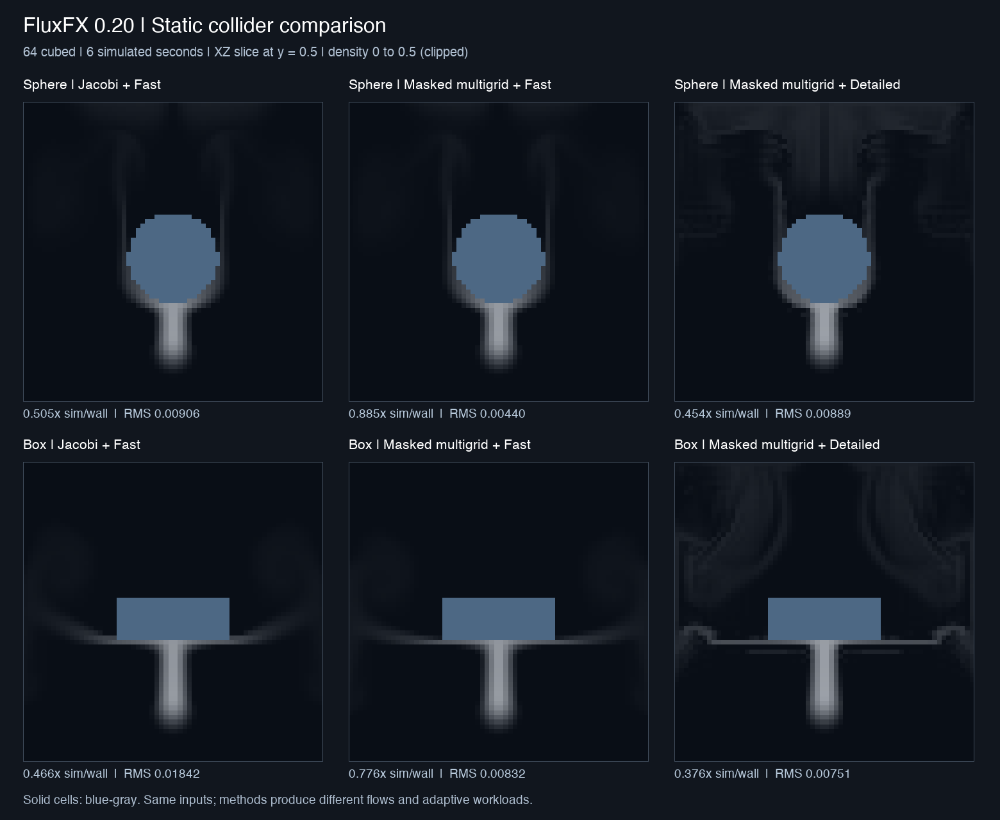

# FluxFX 0.20 — collider speed and smoke detail

Static sphere and box scenes now support obstacle-aware multigrid pressure and
Detailed scalar/velocity transport. Collider placement still uses Blender Empty
objects; moving, resizing or changing them requires Reset.

## Use

Install `fluxfx-0.20.0.zip` in Blender 5.3, then create a domain and add colliders.
Keep **Pressure → Auto** and start at **64³**. In **Flow**, select **Fast** density
and motion for lower cost, or **Detailed** for greater detail retention. Both
selectors work with colliders and can change during playback. The default remains
Detailed, matching scenes without colliders. Pressure cycles are live; changing
the pressure method requires Reset. Jacobi remains available as a baseline.

No additional package installation is needed. The small coarse pressure inverse
uses NumPy already bundled with Blender. GPU compute still uses Blender's public
`gpu` API and Metal on the tested M5 Pro.

## Measured tradeoff

Matched 64³ sphere and box stress scenes, six simulated seconds, Apple M5 Pro /
Metal, Blender 5.3.0 Alpha build b2e052b7172a. Scene inputs match the
[0.19 stress test](COLLIDERS.md): strong heating and a 1 m/s upward jet. All six
runs finished with finite fields, bounded velocities, zero density inside solids,
and smoke above the obstacle.

| Scene and mode | Median cost per 1/30 s simulated | P95 | Simulated / wall time | Final divergence RMS |
|---|---:|---:|---:|---:|
| Sphere, Jacobi + Fast baseline | 67.97 ms | 72.87 ms | 0.505× | 0.009057 |
| Sphere, masked multigrid + Fast | 37.25 ms | 42.02 ms | 0.885× | 0.004398 |
| Sphere, masked multigrid + Detailed | 74.92 ms | 75.66 ms | 0.454× | 0.008894 |
| Box, Jacobi + Fast baseline | 74.32 ms | 76.40 ms | 0.466× | 0.018418 |
| Box, masked multigrid + Fast | 44.30 ms | 46.08 ms | 0.776× | 0.008317 |
| Box, masked multigrid + Detailed | 91.60 ms | 92.83 ms | 0.376× | 0.007509 |

Fast throughput improved **1.75× for the sphere and 1.66× for the box** relative to
the Jacobi baseline rerun in this session. This is completed simulation work,
including adaptive-step selection and a GPU completion fence, excluding shader
compilation, Reset, viewport rendering and timer scheduling. It is not viewport
FPS. Different pressure/transport methods change the flow and adaptive workload;
this is a matched scene comparison, not equal numerical trajectories. These
stress cases remain below realtime. Earlier 0.19 timings came from a different
run; use the rerun above for the speed comparison.

Detailed transport costs more but preserves scalar structure away from walls.
A separate constant-velocity Gaussian translation test with a static sphere
present reduced mean absolute error from **0.001109 to 0.000574 (48.3%)**. Peak
density was 0.795 versus 0.536 with Fast, with both bounded by the initial field.
This reference test measures transport error; the plume images show evolving
coupled simulations and cannot by themselves establish accuracy.

The six-second final slices use the same linear density scale, clipped at 0.5.
They are numerical field slices, not rendered smoke.

## Pressure implementation

The fine pressure graph has an edge only between adjacent fluid cells. Each
coarse unknown aggregates eight children. Restriction is their average and
prolongation is piecewise constant, so the coarse graph is the Galerkin operator
`A_coarse = Pᵀ A_fine P / 8`. Positive-axis conductances are boundary-edge sums
divided by eight, stored in RGBA32F textures with an active-cell flag.

Before accepting a level, every aggregate's active children must be connected
by positive graph edges. Otherwise coarsening stops globally at the preceding
level. This conservative rule prevents merging disconnected chambers through a
wall or erasing an isolated pocket. It may shorten the hierarchy for thin or
complex geometry and reduce the speed advantage. With no usable coarse level,
the solver uses masked Jacobi and its iteration budget.

Each V-cycle uses four weighted-Jacobi passes before and after coarse correction.
For at most 256 coarse cells, Direct mode computes the masked graph's symmetric
pseudoinverse once at Reset, including separate constant null modes for disconnected
components, and uploads it as a texture. Larger coarse levels and Smooth mode use
80 masked smoothing passes. The empty-box inverse is never used for obstacles.
Two cycles are the default, with the existing cold multiplier on the first step.
Pressure impulse starts at zero each step to avoid stale-pressure residuals.

These are approximate solves. The final Fast stress ratios were 0.337 and 0.116
of pre-projection divergence for sphere and box, versus 0.698 and 0.258 for
Jacobi. Increase cycles for stronger projection at higher cost. A fully converged
incompressible solution is not claimed.

## Transport and remaining limits

Predictor and reverse transport now use the same clipped solid backtraces as
Fast transport. Destination solid cells and blocked faces remain zero. Scalar
sampling excludes solid corners. MacCormack correction is used only when source,
destination and reverse-arrival neighborhoods have a fluid halo and the checked
characteristics do not cross solids. Otherwise it falls back to first-order
transport. Velocity correction retains the existing 50% blend for damping.

This intentionally loses correction near walls. Voxel stair steps, diffusion,
sub-cell geometry loss and approximate pressure remain. Colliders are static
analytic primitives; mesh voxelization, moving walls, two-way coupling, sparse
bricks and native C++ are still future work.

Reset reads the static mask and builds the hierarchy on the CPU, so it can pause
the interface at larger resolutions. There is no per-cycle CPU pressure readback.
The measured 64³ field allocations including timestep scratch and completion
fence were 19.24 MiB for Jacobi/Fast, 25.40 MiB for masked multigrid/Fast, and
30.44 MiB for masked multigrid/Detailed. Driver and viewport allocations are extra.

## Validation

**90 standalone tests and 260 Blender checks passed**: 125 existing solver checks,
15 Fast collision checks, 15 Detailed collision checks, 6 analytic/disconnected
pressure checks, 24 benchmark checks, 19 general UI checks, 13 collider UI checks,
36 actual-timer playback checks and 7 save/load checks. The install archive passes
Blender extension validation. Tests use temporary scenes and restore the original;
no user scene is saved or overwritten.

## Reproduce

Run the scripts in a graphical Blender session after `scripts/dev_load.py`.
`collision_validate.py` tests Fast by default; call `run_suite(detailed=True)`
for corrected transport. `collider_detail_validate.py` checks the analytic
translation and disconnected chamber pressure. `release017_validate.py` is the
existing synchronous regression suite, despite its historical filename.

For each benchmark mode, load `scripts/collision_benchmark.py` and call
`run_suite(names=('sphere','box'), pressure_solver=..., detailed=..., label=...)`:
use `JACOBI/False/baseline`, `MULTIGRID/False/fast`, and
`MULTIGRID/True/detailed`. The defaults are 180 frames at 30 Hz and 80 Jacobi
iterations or two multigrid cycles. Reports and raw slices are archived in
`docs/validation/colliders020/`. Standalone topology tests verify the Galerkin
identity, disconnected-child rejection, slab connections and all-solid grids.
