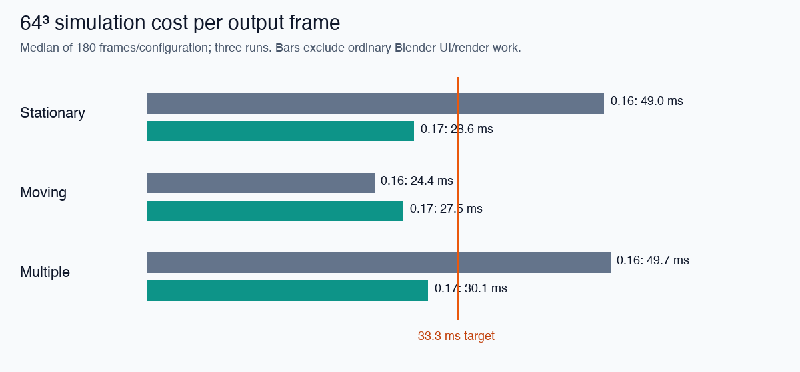
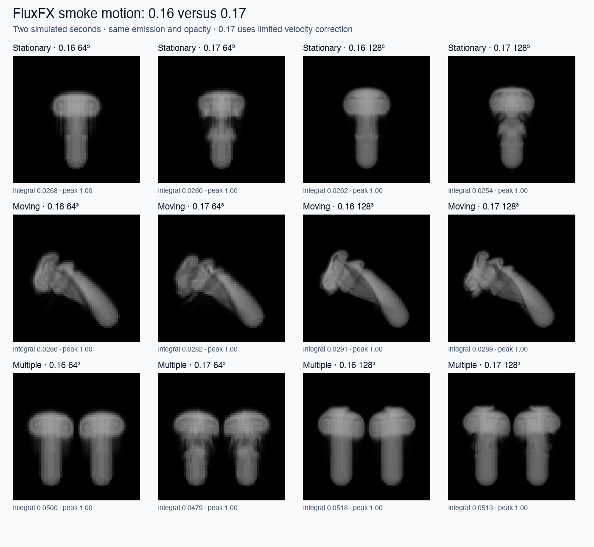

# FluxFX 0.17 — finer motion and faster 64³ simulation

Validated on Apple M5 Pro / Metal, Blender 5.3.0 Alpha build b2e052b7172a,
2026-09-24 (Asia/Kolkata). The dense Python/GLSL design remains intact.

## What changed

**Flow → Motion transport → Detailed** is the new sidebar default. A bounded,
50%-strength MacCormack correction reduces velocity diffusion while retaining
some first-order damping. **Fast** remains available as a live control. The core
Python settings retain Fast for compatibility; the Blender UI selects Detailed.
In a one-second analytic moving-shear test, mean absolute velocity error fell
from 0.007060 to 0.005231, a **25.9% reduction**. This measures transport error,
not a percentage improvement in overall smoke appearance.

**Auto pressure** now uses multigrid for coarsenable grids from 16³, with **two
cycles** by default. Unsupported small/odd grids and explicit Jacobi use the
previous fallback. A direct Neumann solve replaces 80 smoothing passes on the
4×4×4 coarse grid. Other coarse shapes retain smoothing. This direct solve uses a
16 KiB R32F coefficient texture, computed with Python's standard library; no
NumPy, C++, or native Metal integration is required.

Multigrid stores pressure impulse, reuses its estimate, and rescales the guess
when physical dt changes. Adaptive timesteps use the positive CFL quadratic
root with a 1% margin instead of repeatedly halving dt. The CFL limit itself is
unchanged. With default **Auto** policies, Jacobi retains legacy pressure and
quantized timesteps. Explicit backend overrides exist for controlled experiments;
the sidebar chooses these policies automatically.

The initial full-strength correction became unstable in a strong-curl 128³
experiment. The shipped implementation uses the limited correction instead.
Continuous stepping with cheap Jacobi solves also left excessive residual
divergence in some cases, so that combination is not the automatic path. The
release uses convergent multigrid rather than simply lowering the Jacobi budget.

## Measured 64³ results

Three trials per configuration and case, two simulated seconds each, 60 output
frames at 30 FPS. The 0.16 settings were rerun with the same source configuration:
target density 1, solid sphere radius 0.09 m, jet 0.5 m/s, coupling 100/s, Detailed
scalar transport, curl 4/s capped at 2 m/s², heat/buoyancy/decay off. Source
trajectories match [0.16](SMOKE_DETAIL.md). Transport, pressure and timestep
algorithms change, so the resulting fields are not numerically identical.

| Case | 0.16 wall time | 0.17 wall time | Wall-time change | 0.17 median output frame | 0.17 p95 |
|---|---:|---:|---:|---:|---:|
| Stationary | 2.716 s | 1.704 s | −37.3% | 28.6 ms | 33.6 ms |
| Moving | 1.465 s | 1.607 s | +9.7% | 27.5 ms | 29.1 ms |
| Two emitters | 2.672 s | 1.813 s | −32.1% | 30.1 ms | 36.9 ms |

Wall times are medians of three runs. Frame statistics pool all 180 measured
frames per configuration. All three median frame costs meet the **33.3 ms
simulation target**. Some stationary and two-emitter frames exceed it. The moving
source costs more with finer motion. Timings include adaptive GPU readbacks and
a synchronization after every output frame, but exclude ordinary UI/rendering.
They are not a guarantee of sustained 30 FPS in Blender.

The regular preview timer still advances **one adaptive step per tick**; it does
not catch up to wall time. These benchmark output frames advance all necessary
substeps explicitly. No timeline/cache/render-output work is included.

## Quality and 128³ limits

The release preserves more structure beneath the plume head and in interacting
smoke. Integrated density stays within about 4.2% of the 0.16 reference in these
cases. The maximum sampled post/pre projection RMS ratio at 64³ was 0.00795;
ratios are sampled every ten output frames, not every solver step.

128³ uses one new trial per case against the archived 0.16 runs:

| Case | 0.16 wall time | 0.17 wall time | 0.17 median output frame |
|---|---:|---:|---:|
| Stationary | 18.771 s | 16.738 s | 281.9 ms |
| Moving | 13.836 s | 15.553 s | 267.3 ms |
| Two emitters | 22.465 s | 19.195 s | 321.7 ms |

128³ remains far below realtime. Median frame cost can increase even when total
wall time decreases, because the old run had occasional expensive frames. New
sampled divergence ratios stay below 0.00323, though the old four-cycle 128³ solve
was more accurate. Two cycles are a measured speed/accuracy tradeoff; increase
**Multigrid cycles** when greater convergence is needed. Native Blender still
has different dynamics and richer fine detail in the earlier comparison; this
release does not establish superiority or equal quality.

## Implementation and memory

Velocity prediction uses three staggered R32F scratch fields. Reverse sampling is
fused into the correction/source pass, avoiding three extra textures and
separate reverse dispatches. Every component uses the same frozen old velocity.
Correction is limited to the original donor range, falls back at domain edges,
and is blended halfway with first-order transport. Source relaxation applies
once, then buoyancy, confinement, wall conditioning and pressure projection.
The method is not energy- or mass-conservative and is not a turbulence model.
See the [MacCormack paper](https://doi.org/10.1007/s10915-007-9166-4) for the
forward/backward error-estimation approach; this implementation adds its own
limiter, damping and boundary policy.

For multigrid, `q = dt*p` gives `L(q) = div(u)` and `u_new = u - grad(q)`.
The coarse inverse removes the constant Neumann mode and solves mean-free RHS
with a discrete cosine basis. Pure Python and GPU checks independently verify
`L(q)` against the supplied RHS, including a nonuniform domain extent. Pressure
estimates are invalidated on reset, uploads and failure as before.

Known GPU field storage after allocation, including adaptive reductions:

| Configuration | 64³ | 128³ |
|---|---:|---:|
| Detailed scalar + motion, Auto pressure, curl off | 24.873 MiB | 198.047 MiB |
| Same with curl enabled (benchmarked) | 28.873 MiB | 230.047 MiB |

The optional multi-source table adds 512 bytes. These exclude driver, shader,
viewport and process overhead. Scratch allocations remain until GPU release.
On M5 Pro they consume shared system memory.

## Validation and reproduction

- 76 standalone tests passed.
- 125 graphical solver/source tests, 17 UI/lifecycle checks and five background
  save/load checks passed.
- Two additional six-second 64³ stress runs passed (jet-only and heated smoke,
  both with curl 4, closed walls and Detailed motion). They completed 959/1059
  adaptive steps without nonfinite fields or a timestep safety stop. Sampled
  pressure residuals satisfy the stress suite's relative/absolute tolerance.
- All 21 final benchmark runs completed. Full results, run ranges, p95 values,
  projection samples and exact settings are in
  [validation/motion-017](validation/motion-017/summary.json).

Load `scripts/dev_load.py` in graphical Blender, then run
`scripts/release017_validate.py`, `scripts/ui_validate.py` (asynchronous), and
`scripts/motion_stress_validate.py`. Run `scripts/source_save_validate.py` in a
fresh background Blender process for file persistence checks. GPU tests require
a graphical context.

With the native 0.15 reference arrays present under `test-results/comparison`,
run `scripts/release017_benchmark.py`. It writes a separate `test-results/release017`
directory. After completion, run `scripts/release017_report.py` with NumPy/Pillow
outside Blender. Reporting dependencies are not add-on dependencies. Raw fields
are excluded from the source ZIP; regenerate earlier reference data using the
instructions in [NATIVE_COMPARISON.md](NATIVE_COMPARISON.md) and
[SMOKE_DETAIL.md](SMOKE_DETAIL.md) if needed.

New scenes use the new defaults. Existing `.blend` files retain explicitly saved
cycle counts and controls; choose Auto, two cycles and Detailed motion to try
this configuration. Simulation fields remain ephemeral. Mesh collisions, sparse
storage, combustion, cache/seek, and final renderer integration remain pending.
