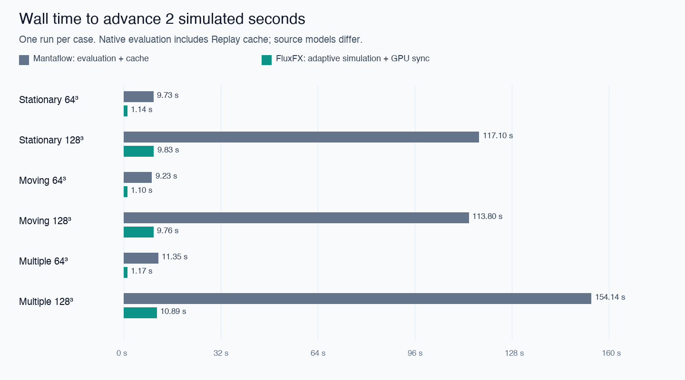
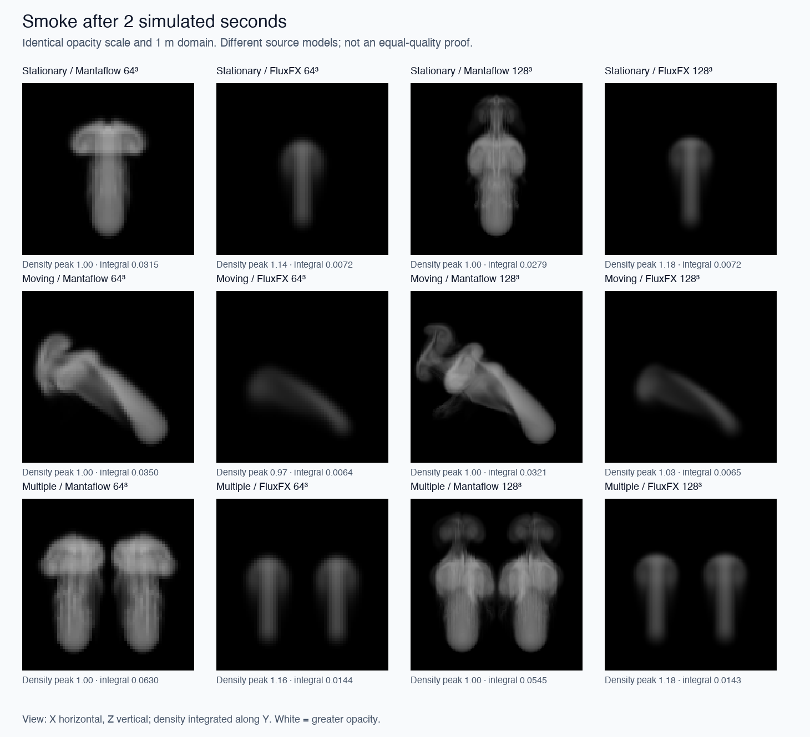

# Version 0.15 — native Mantaflow comparison

This release adds measurement tools and evidence; the fluid solver is unchanged
from 0.14. It is a **preliminary workflow comparison**, not a claim of equal-quality
superiority. Each case advances 60 output frames at 30 FPS (2 simulated seconds).

## Measured results

September 23, 2026. Wall seconds to advance **2 simulated seconds**; one trial each.

| Source case | Grid | FluxFX simulation + sync | Mantaflow evaluation + cache |
| --- | ---: | ---: | ---: |
| Stationary | 64³ | 1.14 s | 9.73 s |
| Moving | 64³ | 1.10 s | 9.23 s |
| Two sources | 64³ | 1.17 s | 11.35 s |
| Stationary | 128³ | 9.83 s | 117.10 s |
| Moving | 128³ | 9.76 s | 113.80 s |
| Two sources | 128³ | 10.89 s | 154.14 s |

The measured workflow-time ratios are 8.4–9.7× at 64³ and 11.7–14.1× at 128³.
**These are not equivalent-quality solver speedups.** Native includes cache and
scene evaluation work; source profiles, injection, and pressure accuracy differ.



FluxFX used 232 substeps at 64³ and 465–466 at 128³ to reach exactly two seconds.
Its median output-frame computation was 18.8–19.8 ms at 64³ versus 167.5–186.9 ms
at 128³; p95 was 19.4–20.4 ms versus 170.1–188.7 ms. Thus **128³ is not realtime at
this quality/stepping configuration**, despite being faster than the tested native
workflow. At 64³ the benchmark's computation fits a 33 ms budget, but actual
interactive playback still needs time catch-up and end-to-end UI measurement.
Native median evaluation was 151–167 ms at 64³ and 1.85–2.64 s at 128³.

## What the images show



Native plumes show broader caps, curling, and more fine structure, especially at
128³. FluxFX plumes are smoother and narrower. Peak density is similar (~1 versus
~1.0–1.18), but native integrated density is approximately **3.8–5.5× higher**.
Matching the peak did not match total emitted material or shape. Source/injection
and numerical differences confound a pure advection-quality comparison.

These images do not support claiming that FluxFX has matched Mantaflow's visual
quality. The next evidence-driven work should calibrate source/velocity behaviour,
add a transport test with a known reference, and assess less diffusive advection
and preservation of rotational flow. Mesh emission can follow, but adding shapes
alone will not address the visible quality gap. This is a recommendation, not a
solver change in 0.15.

## Display and memory results

Using the identical diagnostic renderer, median draw times ranged **0.66–0.95 ms**
for both engines' final density fields. That provides no evidence of a meaningful
native-versus-FluxFX viewport advantage: native viewport rendering was not timed.

| Quantity | 64³ | 128³ |
| --- | ---: | ---: |
| FluxFX known field allocations | ~18.24 MiB | ~157.84 MiB |
| Native fresh-process peak RSS | 337.6–339.3 MiB | 1170.6–1176.8 MiB |
| Native temporary Replay cache | 160.6–172.0 MiB | 1309.9–1361.3 MiB |

Field allocations and process RSS are **not comparable total-memory measures**.
Native temporary caches were deleted after extracting the results. FluxFX does not
yet provide an equivalent persistent cache, so zero cache use is missing capability,
not automatically an optimization advantage.

All 12 timed cases passed data-validity checks; 66 standalone tests pass. Raw
per-frame timings, substep counts, settings, diagnostics, and density metrics are
in [summary.json](validation/comparison-015/summary.json) and adjacent case reports.
The final density arrays remain in the local `test-results/comparison` folder for
regenerating the figures; scripts can reproduce them from scratch.

## Reproduce

Use Blender 5.3.0 Alpha b2e052b7172a on Apple M5 Pro / Metal. Run native cases in
separate factory-startup processes, sequentially; do not run GPU tests concurrently:

```
Blender --background --factory-startup --python-exit-code 1 \
  --python scripts/compare_mantaflow.py -- --grid 64 --case stationary --frames 60
```

Repeat for 64/128 and stationary/moving/multiple. The moving source travels from
x=.25 to .75 m across frames 1–60. Multiple means two sources at x=.3 and .7 m.
Each radius is .09 m; all sources are centered at y=.5, z=.2. Domains are 1 m
cubes with closed boundaries. Jets point along +Z at the requested .5 m/s.
Gravity, buoyancy, temperature, vorticity/noise, density decay, and adaptive domain
resizing are disabled to isolate transport and emission. Adaptive stepping uses
CFL .75; the two solvers implement different bounds and pressure solvers.

After all native cases finish, run `scripts/compare_fluxfx.py` through `runpy`
with `run_name='__main__'` in graphical Blender after the development loader.
It pauses existing playback, preserves the user's solver/scene, and schedules one
case per timer callback. Run `scripts/comparison_report.py` with NumPy/Pillow
to generate static figures and summaries. The add-on itself needs neither package.

Raw results and compressed float32 density fields are written to
`test-results/comparison`. Completed JSON records and figures are retained under
`docs/validation/comparison-015`. Transient native Replay caches use a temporary
directory and are removed after each case. No user scene or simulation cache is
overwritten.

## Timing boundaries and limitations

- Native wall samples wrap scene-frame evaluation, mesh/source processing, fluid
  solving, and **Replay UNI cache writes**. FluxFX samples include source setup,
  adaptive reductions, every substep required to reach the output-frame time,
  and a GPU dependency fence/readback. They exclude viewport drawing.
- Native runs in a fresh background Blender process. FluxFX runs in the existing
  graphical Blender session with playback paused. Neither process startup nor
  scene/shader setup is in the main timing table. First-frame costs are included.
- The benchmark explicitly advances FluxFX to each output-frame time. Normal
  FluxFX playback currently requests one solver step per timer tick and does not
  catch up to wall time. Benchmark frame rate is **not current interactive FPS**.
- There is one run per case, in fixed order. Per-frame distributions are not
  independent repeated trials. Thermal conditions, caches, and background activity
  can affect results; no confidence intervals or universal speedups are claimed.
- Native inflow uses density 1 with absolute emission, volume density 1, and the
  default one-cell surface band. FluxFX injects 5.2 density units/second using a
  smooth compact spherical profile and relaxes local velocity toward its jet at
  20/s. These source models and effective source shapes are **not equivalent**.
  Moving sources use native sampling subframes versus FluxFX's analytic linear
  sweep. Both have source-translation velocity inheritance disabled.
- Native projection accuracy and FluxFX's fixed pressure budgets are not matched.
  No quantitative error-versus-reference or matched-detail performance claim is
  possible from these runs alone.

A pilot with native surface distance zero produced density but zero jet velocity.
Those timings were discarded. Using the default surface band restored flow; final
runs assert nonzero density, expected grid length, and nonzero native velocity.
Density must be read from the evaluated domain modifier, not its original object.
Native velocity-grid values are internal grid quantities, not reported as m/s.

## Preview, memory, and visual comparison

Both final density fields are timed with **the same FluxFX offscreen renderer**:
512×512 target, 128 samples/ray, 20 measured draws after five warmups, synchronized
with one-pixel readback. Native density upload occurs outside the draw timer. This
isolates display cost for these fields; it does not measure Blender's native
viewport renderer, user-input latency, or whole-application FPS. Output-frame p95
is a simulation blocking-time proxy only.

FluxFX reports known GPU field allocations (including its adaptive reductions,
optional source table, and benchmark fence). Native reports the fresh process's
peak resident memory, including Blender, geometry, solver/cache work, and diagnostic
reads. These are different scopes and must not be divided into a memory speedup.
Native cache size is reported separately. Shared Apple GPU memory and driver
allocations prevent a clean total-memory comparison from these counters alone.

The image uses integrated density along Y with the same opacity mapping
`1 - exp(-3 * integral density dy)`, at identical scale and view. No per-image
normalization or artistic adjustment hides density differences. It is a diagnostic
projection, not a lit render or a test of realism. Density peak, integrated amount,
height centroid, and occupied fraction are provided to expose source/shape
mismatches; none is a standalone quality score.

API references: [native domain settings](https://docs.blender.org/api/main/bpy.types.FluidDomainSettings.html)
and [native flow settings](https://docs.blender.org/api/main/bpy.types.FluidFlowSettings.html).
