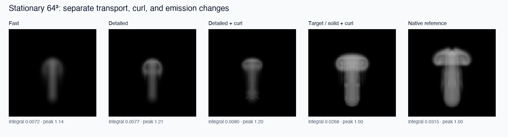
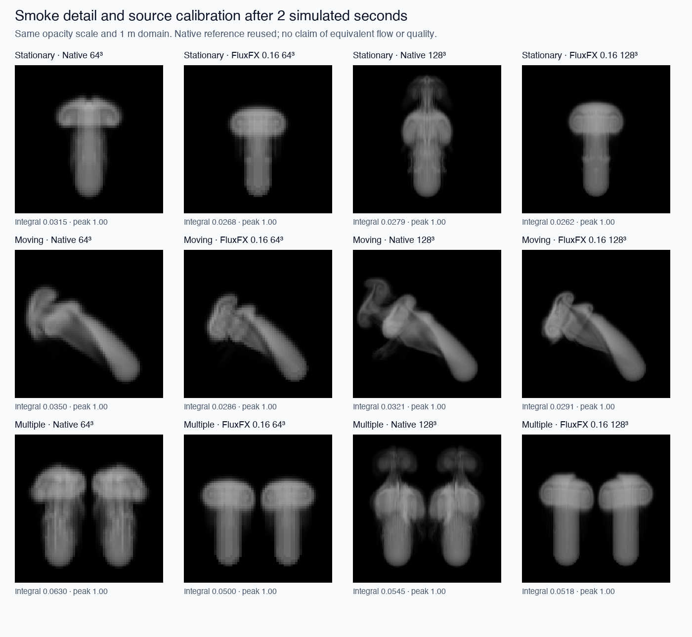

# FluxFX 0.16 — smoke detail and source calibration

Validated on 2026-09-24 (Asia/Kolkata), Apple M5 Pro, Metal, Blender 5.3.0 Alpha
build b2e052b7172a. This release keeps the dense Python/GLSL architecture.

## Controls

Under **Flow**, choose **Smoke transport → Detailed** (new UI default) to reduce
smearing of density and signed temperature. **Fast** retains the earlier method.
**Curl strength /s** adds small-scale rotational force; it defaults to zero.
Try 4 with **Curl acceleration limit** 2 m/s² for the comparison configuration.
These controls change live without resetting the smoke.

Each primary/additional source now has **Density emission** and **Source profile**:

- **Additive rate** adds density per second, as in earlier versions.
- **Target density** maintains a minimum weighted density where the source acts;
  it does not cap existing denser smoke. Heat remains additive in K/s.
- **Soft sphere** retains the smooth compact falloff. **Solid sphere** has a
  uniform interior. Both support analytic swept emission for moving sources.

For the calibration experiment use target density 1, solid sphere, radius 0.09 m,
jet (0, 0, 0.5) m/s, velocity coupling 100/s, Detailed transport, curl 4/s,
acceleration limit 2 m/s². Disable heat, buoyancy and decay. The scripts begin
with empty fields; ordinary **Reset** still creates the historical soft initial
seed, independent of the continuous emission profile. These experimental source
settings are not the default and are not a universal Mantaflow preset.

## Numerical implementation

Two reusable R32F scratch textures implement source-free forward and reverse
RK2 semi-Lagrangian transport. MacCormack correction is clamped to the original
8-voxel donor range; boundary crossings fall back to the first-order result.
Decay and injection are applied once after correction. This improves transport
accuracy but is not mass-conservative. Velocity transport remains first order.
The core `PressureSettings` default stays Fast for backward compatibility;
the Blender sidebar default is Detailed.

A writable RGBA32F 3D texture stores cell-centered curl and its magnitude.
The confinement force is `strength * min(cell_size) * cross(normalized_gradient,
curl)`, capped by the acceleration limit, averaged onto staggered faces, then
pressure-projected. Adaptive stepping includes the configured force bound.
Projection can still alter velocities beyond that estimate. Curl is an artistic
small-scale force, not a substitute for finer physical resolution.

Target sources use the maximum weighted target; additive sources sum before that
maximum, so mixed source results do not depend on list order. Swept targets use
time-averaged exposure along the path; they do not guarantee full target density
at every point touched by a fast source. Source occupancy and jet relaxation
remain different from native Blender's mesh flow model.

## Measured results

A 32³ Gaussian transported for one simulated second had mean absolute error
0.001109 with Fast and 0.000576 with Detailed: **48.1% lower error**. Peak density
was 0.504 versus 0.747. This is an isolated known-reference transport test,
not a general smoke-quality percentage.

Stationary 64³, identical original soft additive emission, two simulated seconds:

| Variant | Wall time | Median time per 1/30 s output frame |
|---|---:|---:|
| Fast | 1.181 s | 19.69 ms |
| Detailed | 1.338 s | 22.85 ms |
| Detailed + curl 4 | 1.425 s | 23.81 ms |
| Detailed + curl + target/solid calibration | 2.662 s | 47.93 ms |

Detailed added about 13% wall time in this trial. The calibrated source changes
the flow and adaptive step count, so its cost is not attributable solely to
transport/curl kernels.

All following FluxFX cases use the calibrated configuration, two simulated
seconds, 60 output frames at 30 FPS, adaptive substeps and a GPU synchronization
per output frame. Native values reuse the unchanged 0.15 reference, including
Replay cache writes. They are workflow timings, not equal-quality solver speedups.

| Case | FluxFX 64³ | FluxFX 128³ | Native 64³ reference | Native 128³ reference |
|---|---:|---:|---:|---:|
| Stationary | 2.662 s | 18.771 s | 9.733 s | 117.103 s |
| Moving | 1.410 s | 13.836 s | 9.232 s | 113.798 s |
| Two emitters | 2.560 s | 22.465 s | 11.350 s | 154.145 s |

At 64³, calibrated median output-frame costs range 23.3–47.9 ms; stationary and
two-source runs miss a 30 FPS budget. At 128³, medians are 229–346 ms, below
realtime. These omit ordinary Blender UI/render work. Actual preview playback
still requests one adaptive step per timer tick, without wall-time catch-up.

Integrated density is now 79–95% of the native reference (previously about
18–26%), with peak density 1 in all calibrated cases. Matching smoke amount is
not matching its dynamics. The images show wider heads and sharper transport,
but native 128³ still has richer fine structure and different plume development.

## Memory, validation and reproduction

Detailed transport allocates an additional 8 bytes/cell (2 MiB at 64³, 16 MiB at
128³). Curl adds 16 bytes/cell (4/32 MiB). Both together bring known field storage
to 24.239/205.844 MiB including adaptive reductions; the multi-source table adds
512 bytes. Allocations are lazy and retained until release, even if a control is
switched off. These figures exclude driver, shader, viewport and process memory.

69 standalone tests passed. Graphical Blender checks passed: 14 new detail checks,
22 multiple-source, 18 motion, 11 object-emitter and 17 UI/lifecycle checks.
Five background save/load checks include the new settings. Nine quality benchmark
runs completed. Evidence is in [validation/detail-016](validation/detail-016/summary.json)
and adjacent JSON files. These are single trials, not statistical performance bounds.

Load `scripts/dev_load.py` in graphical Blender, then run
`scripts/detail_validate.py`. Run `scripts/detail_benchmark.py` after the native
0.15 reference data exists under `test-results/comparison`; it writes a separate
`test-results/detail-comparison` directory. Run `scripts/detail_report.py` using
Python with NumPy/Pillow to regenerate the figures. Reporting dependencies are
not add-on dependencies. The source archive excludes transient raw benchmark
fields; rerun `scripts/compare_mantaflow.py` as described in
[NATIVE_COMPARISON.md](NATIVE_COMPARISON.md) when those reference fields are absent.

Further quality work should address velocity diffusion and pressure/time-step
costs before interpreting confinement as native-quality equivalence. Mesh
collisions, combustion, sparse storage, caching and final-render integration
remain outside this release.
