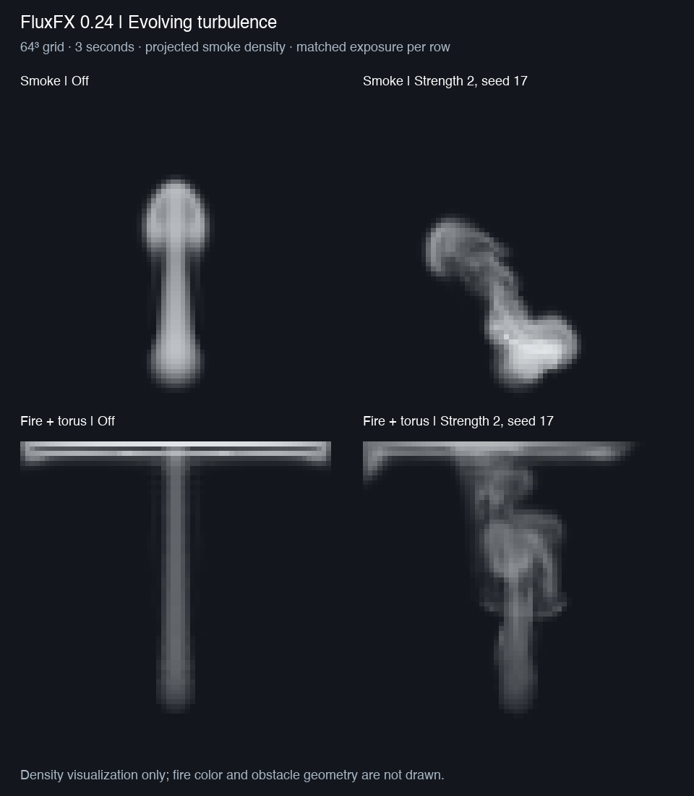

# 0.24 — Evolving turbulence

FluxFX can now add repeatable, evolving motion at up to four spatial scales to
its dense GPU velocity field. This is procedural transverse Fourier forcing:
three waves per scale, with perpendicular force directions and diminishing
amplitudes. It is an artistic turbulence prototype, not a calibrated physical
turbulence model or wavelet upres.

## Use in Blender

Install `fluxfx-0.24.0.zip`, create a smoke domain, Reset, then Play. In the FluxFX
sidebar expand **Turbulence · evolving scales**. All its controls update live.

| Control | Meaning / starting value |
| --- | --- |
| Strength | Acceleration multiplier in m/s²; start at 1–2. Zero disables the force. |
| Largest size | Largest wavelength in simulation metres; start at 0.5. Each additional scale halves it. |
| Evolution speed | Phase evolution multiplier; 0 freezes the force pattern in space. Default 0.5. |
| Seed | Repeatable wave directions, phases and evolution rates. |
| Scales | 1–4 bands, subject to grid filtering. Default 3. |
| Acceleration limit | Maximum local added force magnitude before masking/projection, in m/s². Default 2. |
| Apply in | Everywhere, Smoke, or Hot regions. |
| Full effect at | Density threshold for Smoke; temperature excess above ambient in kelvin for Hot regions. |

For fire, try **Hot regions**, threshold **150 K**, strength **2**, size **0.5 m**.
Start at 32³ when combining fire and obstacles. Settings survive `.blend`
save/load. Seed, size, and speed edits can change the force abruptly; use Reset
with the same initial conditions and settings for a comparison. Changing speed
recomputes phase from elapsed simulation time; it does not preserve the previous
phase offset. Source animation and timestep schedules must also match for replay.

Wavelengths at or below four cells are removed, with a smooth ramp to full
strength at eight cells. This uses the largest cell dimension on non-cubic grids.
Increasing Scales cannot recover detail that the grid cannot resolve. For
example, a 1 m domain at 32³ with size 0.5 m fully resolves the first two bands;
the 0.125 m band is filtered out. Scene-domain display scaling follows the existing
FluxFX convention; it does not rescale the internal simulation.

## Implementation and limits

The pure Python spectrum generator is in `physics/turbulence.py`; optional GPU
storage/dispatch is in `backend/turbulence.py`; the force kernel is
`shaders/turbulence.glsl`. Blender UI settings remain in `blender/`.

The force samples each staggered velocity face, then uses the existing vorticity
and pressure passes. Transverse waves have zero analytic divergence before
clipping/masking. Face sampling, magnitude clipping and density/heat masks can
introduce divergence, which the approximate pressure solve then reduces. The
acceleration cap bounds the added force, not the final fluid velocity or the
post-projection change. The adaptive timestep includes a conservative bound on
this force, even if masking/filtering makes the actual force smaller.

Smoke/heat masks use the average of the two adjacent scalar cells, clamped to
0–1 after division by the threshold. Solid wall enforcement remains the existing
voxel collision/projection path. Fire-and-mesh tests verify that density, heat
and fuel remain zero inside solid cells. This does not add cut-cell collisions,
moving mesh support, or extra spatial resolution.

No new Blender API blocker was encountered on the tested Metal build: R32F 3D
textures support the lookup table and face outputs. Storage is allocated on the
first enabled step: three MAC face fields plus a 384-byte wave table, about
**0.387 MiB at 32³** or **3.047 MiB at 64³**. Starting with strength zero allocates
none of these textures and skips the three force dispatches. Turning strength
back to zero retains allocated scratch until Reset/release.

Checkpoint phase derives from saved simulation time and settings; no extra phase
buffer is required. The existing checkpoint API remains collider-free and its
repeatability guarantee is limited to the tested hardware/build and matching
fixed-step source schedules. Cross-platform bitwise reproducibility is untested.
Large elapsed times may eventually lose phase precision in shader floats.

## M5 Pro results

Blender 5.3.0 Alpha, build `b2e052b7172a`, Apple M5 Pro / Metal, 2026-09-28.
Each case runs three simulation seconds after a warmup/reset, with Detailed
scalar and velocity advection, adaptive CFL 0.75, and maximum step 1/30 s.
The on/off pairs share settings apart from strength (0 versus 2); seed is 17.
Smoke uses a density mask; fire uses a heat mask and a static torus collision SDF.
GPU work is fenced to completion. Timings exclude setup/SDF construction,
viewport drawing and final field readbacks. These are single-run observations,
not a general real-time guarantee.

| Case | Speed, off → on | Median cost per 1/30 s, off → on | On p95 |
| --- | --- | --- | --- |
| 32³ smoke | 9.35× → 7.30× | 3.19 → 4.88 ms | 5.56 ms |
| 64³ smoke | 2.99× → 1.90× | 10.81 → 18.59 ms | 19.91 ms |
| 32³ fire + mesh | 2.65× → 2.69× | 11.70 → 13.37 ms | 15.99 ms |
| 64³ fire + mesh | 0.43× → 0.45× | 72.05 → 78.01 ms | 105.67 ms |

Speed is simulated seconds / wall seconds. The slight total-time improvement in
fire is not a cheaper kernel: changing the flow changes the adaptive step count
(696 → 592 at 64³), while median frame cost increases. The 64³ fire case is below
real time in both configurations. Smoke remains above real time in this test.

The image shows mean density along Y, with identical exposure within each row.
It is a numerical density comparison, not a lit volume render. Fire smoke reaches
the closed top boundary in this short test; horizontal accumulation is visible.
The obstacle and flame colors are not drawn. Raw projections and timing reports
are in [validation/turbulence024](validation/turbulence024).

## Validation

- 113 standalone checks pass, including transverse modes, amplitude bounds,
  filtering, deterministic seeds, invalid settings, and live classification.
- 240 Blender checks pass across GPU force validation, existing solver regression,
  combustion, moving colliders, static meshes, UI lifecycle and save/load.
- Eight matched benchmark cases pass finite-field and smoke/heat/fuel solid
  exclusion checks; enabled forcing changes density in every pair.
- GPU force/reference maximum error: **8.41e-9**. Tests cover acceleration bound,
  empty density/heat masks, unresolved scales, temporal evolution, seed changes,
  fixed-step replay, checkpoint resume and disabled allocation.
- Live turbulence edits, disabling during playback, timer cleanup and preview
  compilation pass. All eight controls survive actual `.blend` save/load.

Run `python3 -m unittest discover -s tests -q` outside Blender. Load the development
add-on with `scripts/dev_load.py`, then run `scripts/turbulence_validate.py` and
`scripts/turbulence_benchmark.py` in graphical Blender. `scripts/ui_validate.py`
checks asynchronous playback and reloads the development add-on itself.
`scripts/source_save_validate.py` runs in background Blender.

Wavelet upres and a larger bake/cache workflow remain separate future stages.
